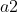

- [Hausaufgabenbesprechung](Hausaufgabenbesprechung.ipynb

# Hausaufgabe

Heute haben wir uns zusammen auf [Geogebra](https://www.geogebra.org/?lang=de) angesehen, wie Zahlen (insbesondere komplexe Zahlen) nicht nur eindimensional auf einem Zahlenstrahl, sondern auf einer zweidimensionalen Ebene dargestellt werden können. Hierbei definieren wir die x-Achse als den reellen Anteil und die y-Achse als den imaginären Anteil einer komplexen Zahl.

**Aufgabe:** Öffnet die Datei `01_zahlenstrahl_zahlenflaeche.ggb` in der [Web-Version](https://www.geogebra.org/classic?lang=de) von Geogebra. (Rechts oben die drei waagerechten Striche anklicken, dann auf `File` --> `Open`. Dann seht ihr rechts ein Ordner-Icon. Durch Klick auf dieses Icon könnt ihr Dateien von eurem Computer auswählen.)

Mittig ist das Koordinatensystem – links Elemente, die im Koordinatensystem dargestellt werden können.

Anfangs sind die Zahlen  und , sowie zwei Slider (oben links im Koordinatensystem) und die Zahl  zu sehen. Durch die Slider könnt ihr  und  auf der X-Achse verschieben. Achtet dabei darauf, was mit der der Summe  passiert.

Durch Klicken in der linken Element-Spalte auf die kleinen Kreise, die sich jeweils links neben den einzelnen Elementen befinden, könnt ihr die Darstellung der jeweiligen Elemente aktivieren oder deaktivieren. Aktiviert nun  und deaktiviert . Achtet darauf, wie  sich , also die Multiplikation beider Werte beim Verschieben der Werte  und  verhält.

Deaktiviert nun alle Elemente (die pinken) und aktiviert stattdessen  und  sowie  (grün). Zunächst sind alle drei Zahlen auch auf der X-Achse platziert. Ihr könnt die Zahlen  und  mit der Maus auf der Fläche herumziehen. Was passiert nun mit , wenn ihr die Zahlen auf der Fläche herumschiebt?

Deaktiviert wieder  und aktiviert stattdesssen . Könnt ihr hier auch ein Pattern feststellen (Tipp: bringt  und  zunächst wieder auf die X-Achse)?

Wir werden uns nächste Woche weitere Operationen mit komplexen Zahlen in Geogebra ansehen.